# E-commerce

이커머스 환경에서 발생할 수 있는 주문 생성, 외부 결제 연동, 재고 차감, 이벤트 유실 방지 문제를 직접 다루기 위해 만든 프로젝트입니다.  
결제 성공 이후 재고 확보에 실패하는 부분 실패 상황, 메시지 브로커 장애로 인한 후속 처리 지연, 중복 웹훅과 중복 이벤트 소비 같은 문제를 전제로 두고 설계했습니다.  

주문, 결제, 재고를 각각 분리된 서비스로 나누고, `PG 결제(Toss Payments)`, `Kafka`, `Saga`, `Outbox/Inbox`, `Idempotency`를 통해 분산 트랜잭션과 장애 복구 전략을 검증하는 것을 목표로 합니다.

## 구성

- `order-service`
  - 주문, 주문상품, 주문상태이력 엔티티
- `payment-service`
  - Toss Payments 기준 결제, 웹훅, 보상, 아웃박스 엔티티
  - `/api/v1/toss/webhooks/payments` 웹훅 엔드포인트
- `inventory-service`
  - 재고, 재고예약, 재고이력, 인박스 엔티티

## 아키텍처

아래 구조를 기준으로 주문, 결제, 재고를 분리합니다.

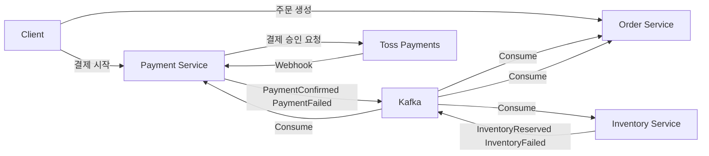

## 시퀀스 다이어그램

### 1. 성공 케이스

Toss Payments 웹훅으로 결제 성공을 확정하고, `PaymentConfirmed` 이벤트를 발행한 뒤 재고 차감과 주문 확정을 진행합니다.

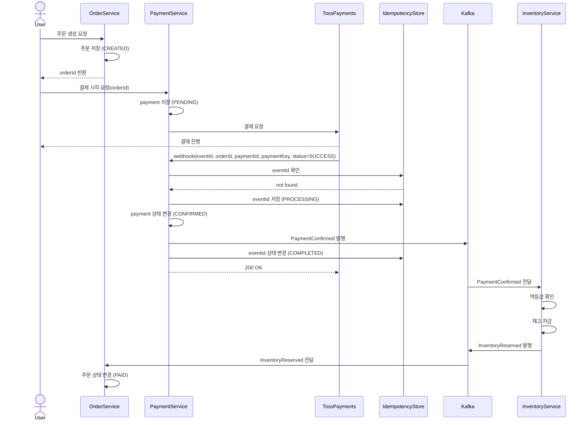

### 2. 부분 실패 케이스

결제는 성공했지만 재고 확보에 실패한 경우, 보상 트랜잭션으로 환불 또는 취소를 수행합니다.

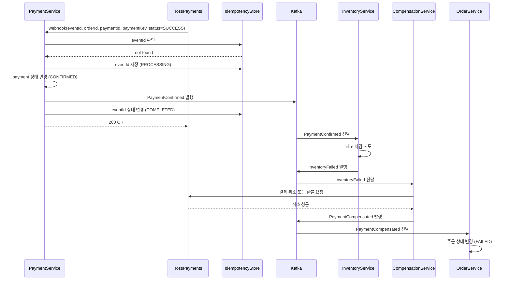

### 3. 장애 케이스

웹훅을 받아 DB 저장은 끝났지만 Kafka 발행 전에 서버가 내려가는 상황을 가정합니다. 이 문제를 막기 위해 `Outbox`를 둡니다.

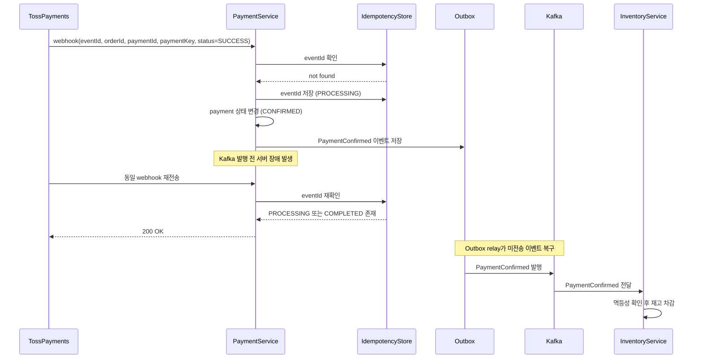

## ERD

서비스 간 FK는 실제 DB FK로 연결하지 않고, `order_id`, `payment_id`, `event_id` 같은 식별자로만 연결합니다.

### Order Service

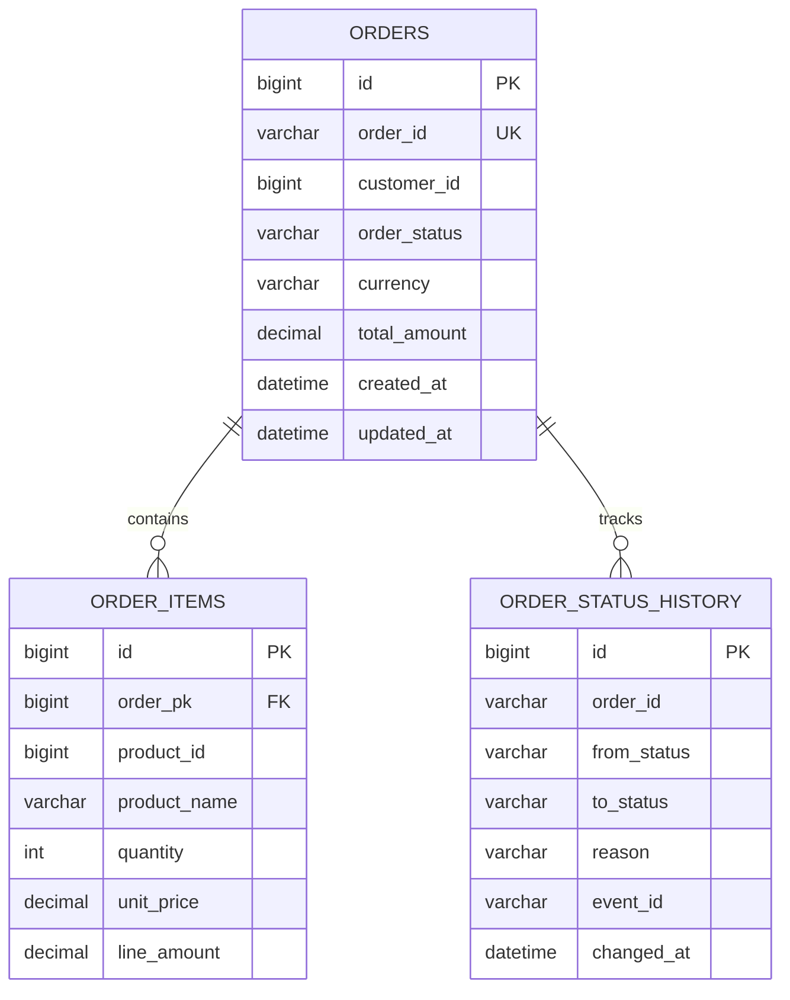

### Payment Service

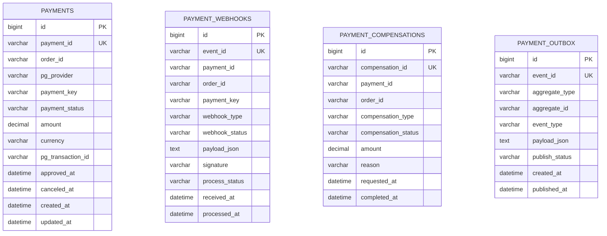

### Inventory Service

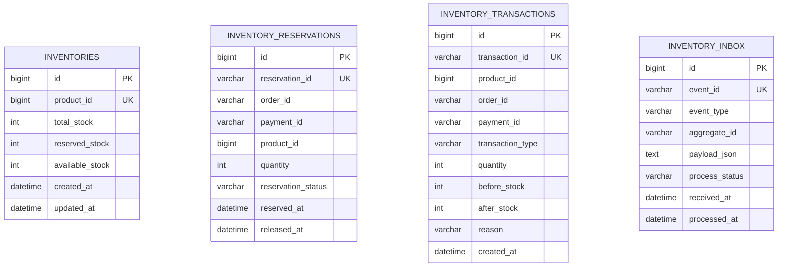

## Kafka 및 장애 대응

이 프로젝트는 Kafka가 항상 정상이라는 가정으로 설계하지 않습니다.  
결제 웹훅을 받은 뒤 `어디까지 저장되었는지`, `어디서 장애가 났는지`에 따라 응답 방식과 복구 전략을 다르게 가져갑니다.

### 1. Kafka 장애

Kafka만 죽어 있고 DB는 정상인 경우입니다.  
이때는 결제 상태와 Outbox 이벤트를 DB에 먼저 저장할 수 있으므로, 웹훅에 `200 OK`를 반환해도 유실되지 않습니다. Kafka 복구 후 Outbox Relay가 이벤트를 재발행합니다.

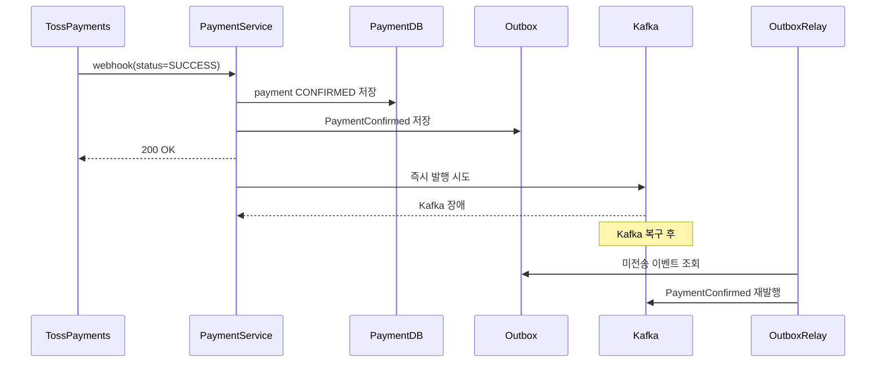

### 2. DB 장애

Kafka는 살아 있어도 DB가 죽어 있으면 결제 상태를 신뢰성 있게 저장할 수 없습니다.  
이 경우에는 이벤트를 먼저 발행하지 않고, 웹훅에 `5xx`를 반환해서 Toss Payments가 동일한 웹훅을 다시 보내도록 유도해야 합니다.

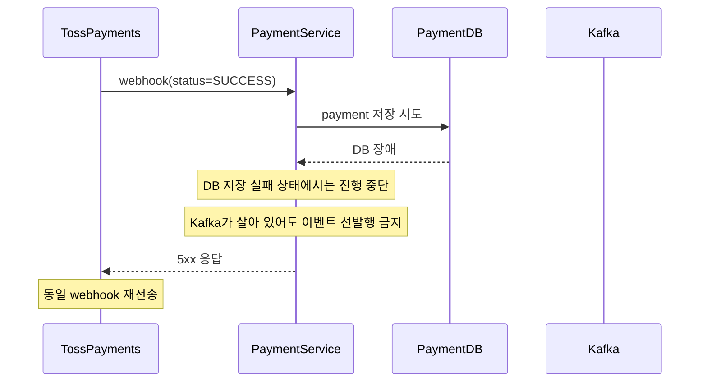

### 3. DB + Kafka 전체 장애

DB와 Kafka가 동시에 죽어 있으면 내부에 결제 성공 사실을 남길 수 없습니다.  
이 상황에서는 성공 응답을 주지 않고 `5xx`를 반환한 뒤, 외부 PG의 웹훅 재시도 정책을 최후 안전장치로 사용합니다.

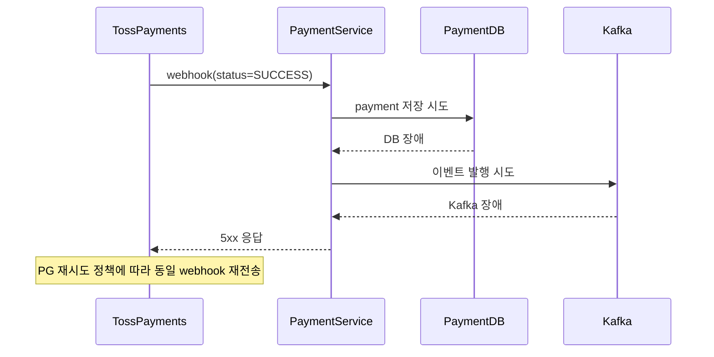

복구 이후에는 재전송된 웹훅을 다시 받아서 `payment 저장 -> outbox 저장 -> kafka 발행` 순서로 정상 처리합니다.

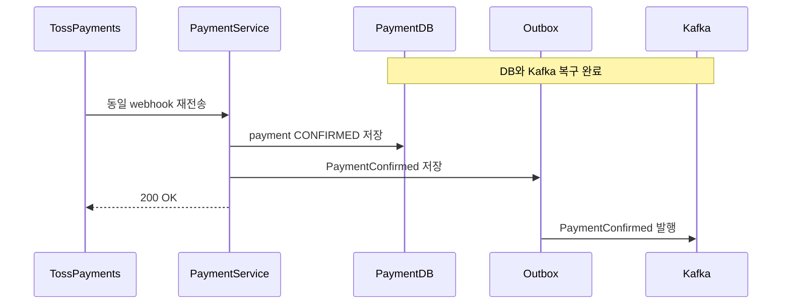

### 장애 대응 원칙

- `DB 저장이 끝나기 전에는 200 OK를 반환하지 않는다.`
- `Kafka만 장애인 경우에는 Outbox에 저장되었는지 확인한 뒤 200 OK를 반환한다.`
- `DB가 장애인 경우에는 Kafka가 살아 있어도 이벤트를 먼저 발행하지 않는다.`
- `DB와 Kafka가 모두 장애인 경우에는 PG 웹훅 재시도를 최후 안전장치로 사용한다.`
- `Kafka 소비 측은 Inbox와 eventId 기반 멱등성으로 중복 처리를 막는다.`
