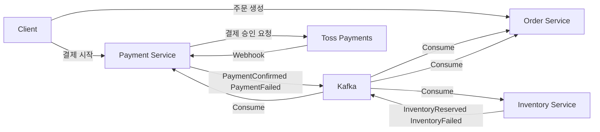
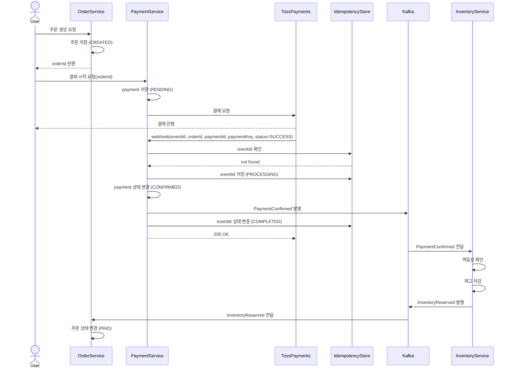
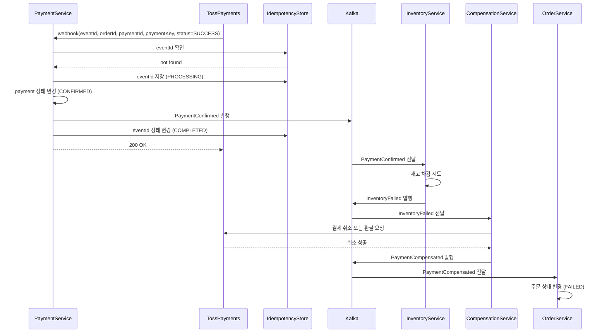
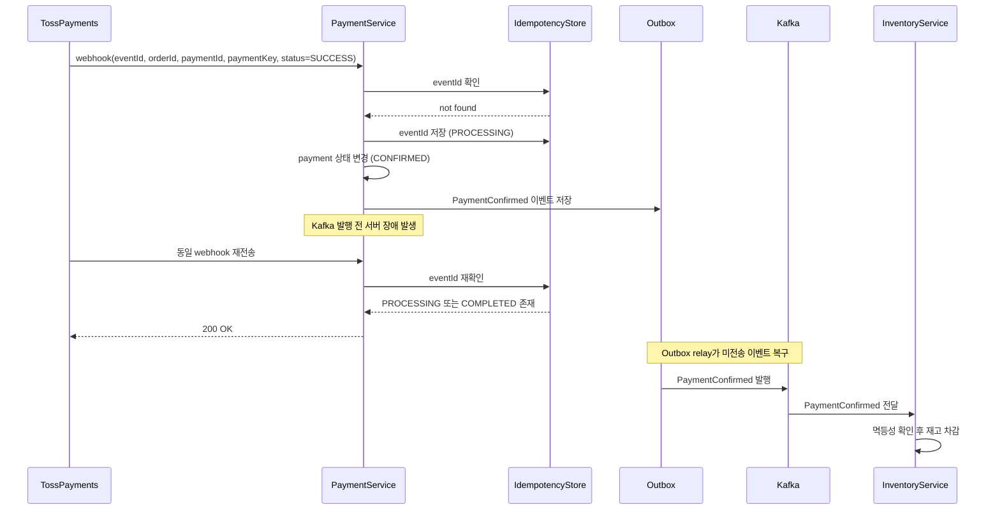
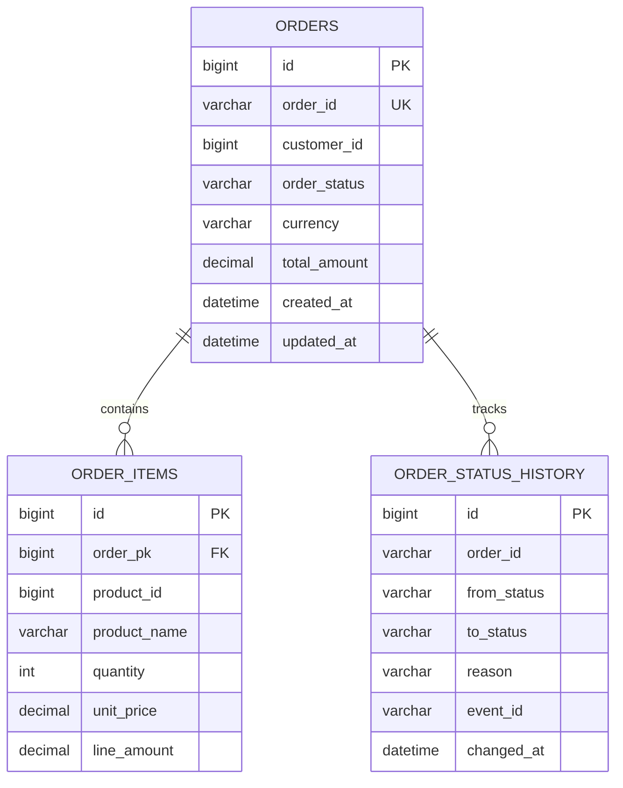
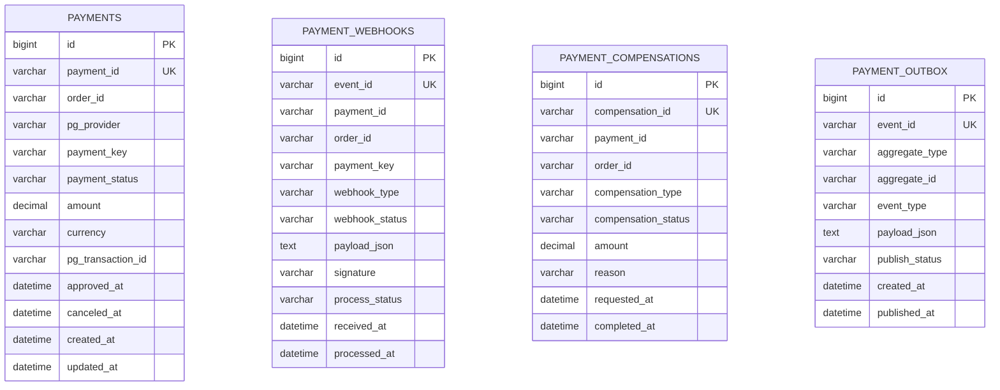
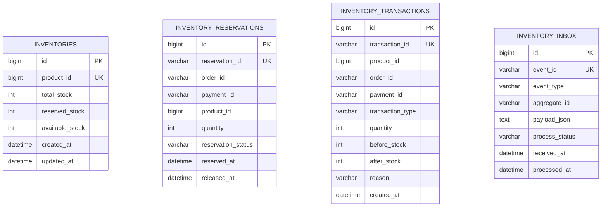

# Order Payment Inventory MSA

`Java 17 + Spring Boot 3 + Spring Data JPA` 기준의 주문, 결제, 재고 서비스 골격입니다.  
외부 결제는 `Toss Payments`, 서비스 간 비동기 연동은 `Kafka`, 데이터 정합성은 `Saga + Outbox/Inbox + Idempotency`를 전제로 설계합니다.

## 구성

- `order-service`
  - 주문, 주문상품, 주문상태이력 엔티티
- `payment-service`
  - Toss Payments 기준 결제, 웹훅, 보상, 아웃박스 엔티티
  - `/api/v1/toss/webhooks/payments` 웹훅 엔드포인트
- `inventory-service`
  - 재고, 재고예약, 재고이력, 인박스 엔티티

## 아키텍처

아래 구조를 기준으로 주문, 결제, 재고를 분리합니다.



## 시퀀스 다이어그램

### 1. 성공 케이스

Toss Payments 웹훅으로 결제 성공을 확정하고, `PaymentConfirmed` 이벤트를 발행한 뒤 재고 차감과 주문 확정을 진행합니다.



### 2. 부분 실패 케이스

결제는 성공했지만 재고 확보에 실패한 경우, 보상 트랜잭션으로 환불 또는 취소를 수행합니다.



### 3. 장애 케이스

웹훅을 받아 DB 저장은 끝났지만 Kafka 발행 전에 서버가 내려가는 상황을 가정합니다. 이 문제를 막기 위해 `Outbox`를 둡니다.



## ERD

서비스 간 FK는 실제 DB FK로 연결하지 않고, `order_id`, `payment_id`, `event_id` 같은 식별자로만 연결합니다.

### Order Service



### Payment Service



### Inventory Service



## 실행

프로젝트 루트의 Gradle Wrapper를 사용합니다.

```bash
./gradlew :order-service:bootRun
./gradlew :payment-service:bootRun
./gradlew :inventory-service:bootRun
```

Windows PowerShell:

```powershell
.\gradlew.bat :order-service:bootRun
.\gradlew.bat :payment-service:bootRun
.\gradlew.bat :inventory-service:bootRun
```

## 현재 구현 범위

- 멀티모듈 Gradle 구조
- 서비스별 Spring Boot 3 설정
- 서비스별 JPA 엔티티 및 Repository
- Toss Payments 웹훅 엔드포인트의 최소 골격

## 다음 구현 후보

- 주문 생성 API와 상태 전이 서비스
- Toss 결제 승인 API 연동 클라이언트
- Kafka 이벤트 발행과 인박스/아웃박스 릴레이
- 보상 트랜잭션 서비스와 테스트
